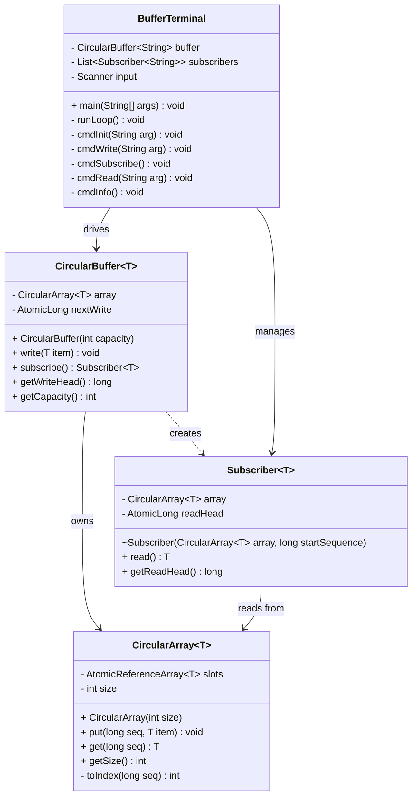
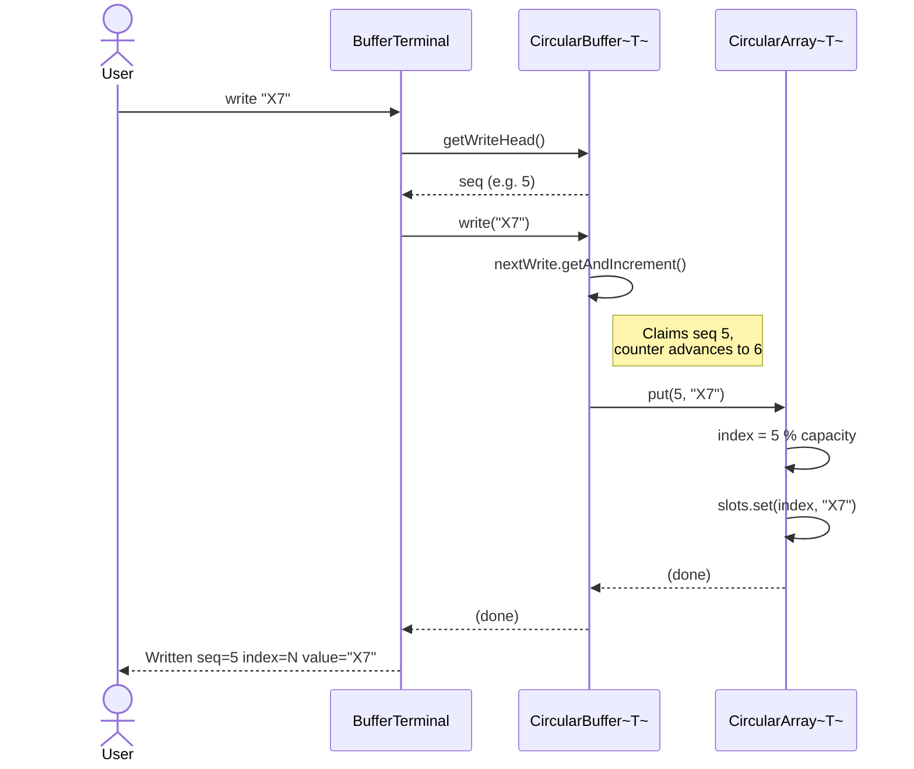
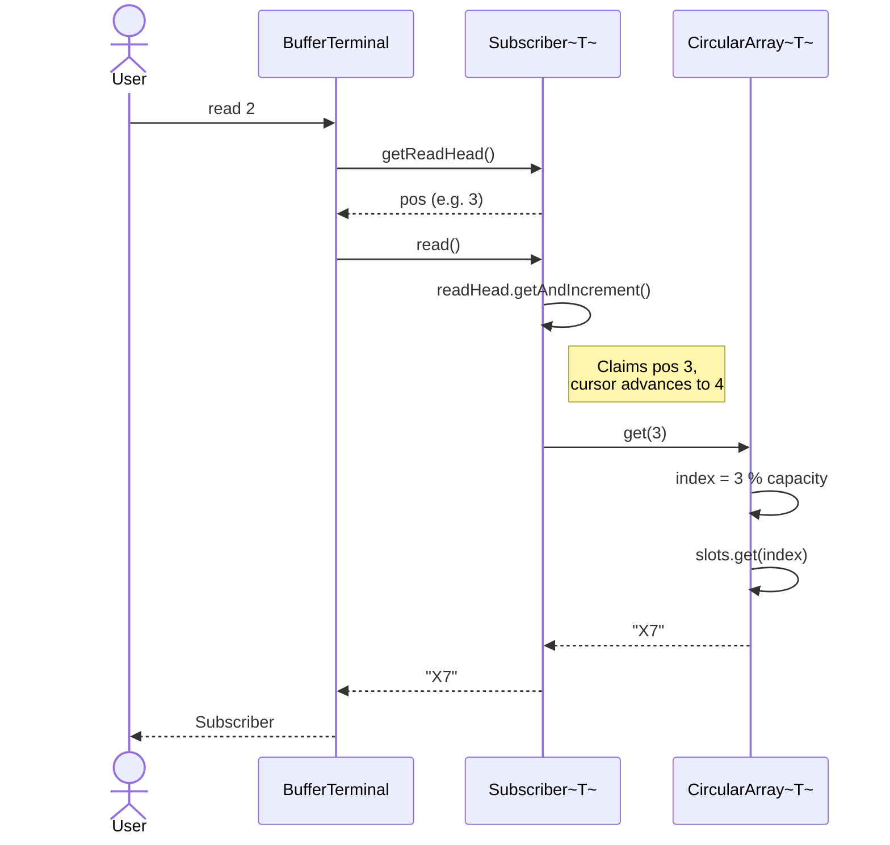

# Circular Buffer — Single Writer, Multiple Subscribers

## Overview

A **circular buffer** (ring buffer) is a fixed-capacity data structure in which a single writer continuously advances a write pointer around a logical circle of memory slots. When the pointer reaches the end of the allocated capacity it wraps back to the beginning, overwriting the oldest data. This makes it well-suited to scenarios where the rate of production can temporarily exceed the rate of consumption, and losing old data is preferable to blocking the writer.

This implementation extends the basic concept to support **multiple independent subscribers**. Each subscriber tracks its own read position and consumes items at its own pace. One subscriber reading — or falling behind — has no effect on any other subscriber. If the writer laps a slow subscriber, that subscriber will read whatever currently occupies the overwritten slot; no exception is raised and the writer is never blocked.

The design prioritises three properties:
- **Non-blocking writes** — the writer always succeeds immediately
- **Subscriber independence** — each subscriber is a self-contained cursor
- **Thread-safe counters** — all sequence positions use `AtomicLong`; the backing array uses `AtomicReferenceArray`

---

## Design

The implementation is divided into four classes. Each class has one clearly bounded responsibility.

### `CircularArray<T>`

Owns the physical storage. Internally it holds an `AtomicReferenceArray<T>` of fixed length. Its only job is to translate a logical sequence number into a physical slot index (`seq % size`) and perform an atomic read or write on that slot. It has no concept of a write head, a read head, or subscribers.

### `CircularBuffer<T>`

The public-facing buffer object. It combines two responsibilities that naturally belong together on the **writer** side: ownership of the shared `CircularArray`, and maintenance of the monotonic write-sequence counter (`AtomicLong nextWrite`). Calling `publish(item)` claims the next sequence number and delegates storage to `CircularArray`. Calling `subscribe()` snapshots the current write head and uses it to construct a new `Subscriber`, acting as a factory.

### `Subscriber<T>`

An independent read cursor. Each instance holds a reference to the shared `CircularArray` and its own `AtomicLong readHead`. Calling `next()` reads the item at the current position and increments the cursor. Because the cursor is local to the subscriber, one subscriber's progress is completely invisible to all others.

### `BufferTerminal`

A command-line driver with no buffer logic of its own. It parses user input, delegates to `CircularBuffer` and `Subscriber`, and formats output. It is the only class that knows about `System.in` and `System.out`.

---

## UML Class Diagram



---

## UML Sequence Diagram — `write()`

Triggered when the user types `write <item>` in the terminal.



---

## UML Sequence Diagram — `read()`

Triggered when the user types `read <N>` to advance subscriber N by one position.



---

## Running the Project

### Requirements

- Java 11 or later (`java -version`)
- All four source files placed under `OO/Assignment_2B/`

### Compile

From the project root (the directory that contains the `OO` folder):

```bash
javac OO/Assignment_2B/CircularArray.java \
      OO/Assignment_2B/Subscriber.java \
      OO/Assignment_2B/CircularBuffer.java \
      OO/Assignment_2B/BufferTerminal.java
```

### Run

```bash
java OO.Assignment_2B.BufferTerminal
```

### Available Commands

| Command | Effect |
|---|---|
| `init <N>` | Create a new buffer of capacity N (resets all subscribers) |
| `write <item>` | Write a string item at the current write head |
| `subscribe` | Register a new subscriber at the current write head |
| `read <N>` | Advance subscriber #N by one and print the item read |
| `info` | Display write head position and all subscriber read heads |
| `help` | Print the command list |
| `exit` | Quit |

### Example Session

The session below uses a capacity-3 buffer with two subscribers to illustrate overwrite behaviour and subscriber independence.

```
>> init 3
Initialised buffer  capacity=3

>> subscribe
Subscriber #1 registered  start-position=0

>> subscribe
Subscriber #2 registered  start-position=0

>> write alpha
Written    seq=0    index=0    value="alpha"

>> write beta
Written    seq=1    index=1    value="beta"

>> write gamma
Written    seq=2    index=2    value="gamma"

>> read 1
Subscriber #1   position=0    value="alpha"

>> read 1
Subscriber #1   position=1    value="beta"

>> write delta
Written    seq=3    index=0    value="delta"    ← overwrites "alpha" at index 0

>> read 2
Subscriber #2   position=0    value="delta"    ← sub #2 missed "alpha"; reads "delta"

>> read 1
Subscriber #1   position=2    value="gamma"

>> info
--- Buffer Info ---
  Capacity   : 3
  Write head : 4
  Subscribers: 2
    #1    read-head=3
    #2    read-head=1
-------------------

>> exit
Exiting.
```

### What to Observe

| Scenario | What happens |
|---|---|
| Two subscribers, same start position | Both begin at seq 0; each advances independently |
| Writer laps slow subscriber | Subscriber #2 skips "alpha" and reads "delta" — overwrite is silent |
| `info` after mixed progress | Each subscriber shows its own distinct read head |
| `init` mid-session | Buffer and all subscribers are discarded; clean slate |
